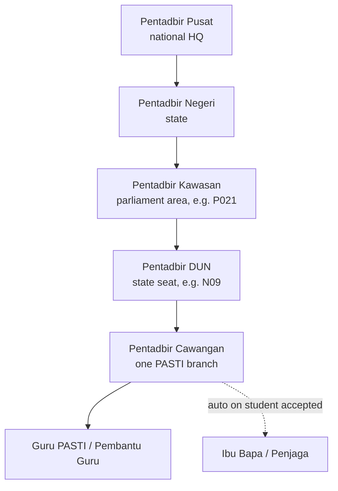
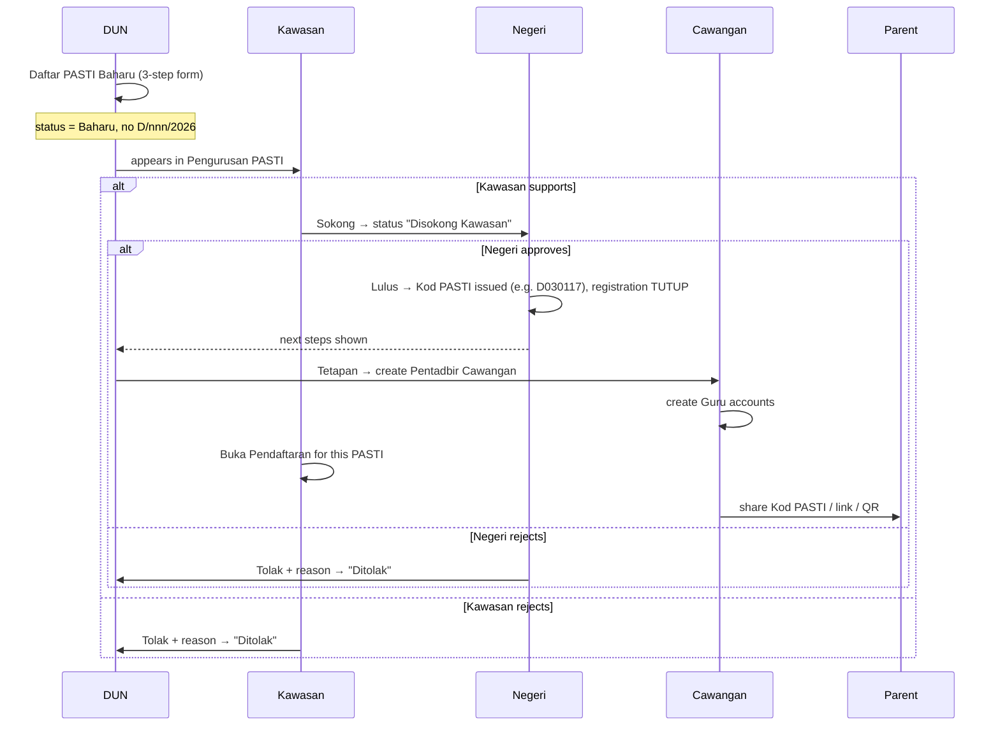
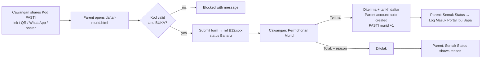

# ePASTI Phase 1 — System Documentation

> Sistem Pengurusan PASTI (ePASTI) · Jabatan PASTI Malaysia
> Static HTML mockup: no backend, all data lives in the browser.
> Last reviewed against the code on 29/09/2026, after the role and bug-fix pass.

---

## Contents

1. [Overview](#1-overview)
2. [Getting started](#2-getting-started)
3. [Roles and hierarchy](#3-roles-and-hierarchy)
4. [Permission matrix](#4-permission-matrix)
5. [Role guides](#5-role-guides)
   - [5.1 Pentadbir Pusat (HQ)](#51-pentadbir-pusat-hq)
   - [5.2 Pentadbir Negeri](#52-pentadbir-negeri)
   - [5.3 Pentadbir Kawasan](#53-pentadbir-kawasan)
   - [5.4 Pentadbir DUN](#54-pentadbir-dun)
   - [5.5 Pentadbir Cawangan](#55-pentadbir-cawangan)
   - [5.6 Guru PASTI / Pembantu Guru](#56-guru-pasti--pembantu-guru)
   - [5.7 Ibu Bapa / Penjaga](#57-ibu-bapa--penjaga)
   - [5.8 Public visitors (no login)](#58-public-visitors-no-login)
6. [End-to-end flows](#6-end-to-end-flows)
7. [Module reference (admin console)](#7-module-reference-admin-console)
8. [Data scoping rules](#8-data-scoping-rules)
9. [Shared engine (how buttons work)](#9-shared-engine-how-buttons-work)
10. [Data storage](#10-data-storage)
11. [Demo data](#11-demo-data)
12. [Known gaps and mockup limitations](#12-known-gaps-and-mockup-limitations)
13. [Developer notes](#13-developer-notes)

---

## 1. Overview

ePASTI manages the PASTI pre-school network across these areas:

- PASTI registration and approval
- Staff and committee (warga)
- Students and parents
- Fees and contributions (yuran, caruman), with **BayarCash** as the only payment gateway
- Attendance
- SPPM assessment
- Calendar and notices
- Campaigns and donations
- Reporting and audit

There are **three portals** plus public pages:

| Portal | Folder | Who | Layout |
|---|---|---|---|
| Admin console (Konsol Pentadbir) | `app/` | Pusat, Negeri, Kawasan, DUN, Cawangan admins | Desktop: sidebar and topbar |
| Portal Guru | `guru/` | Guru PASTI, Pembantu Guru | Phone-first PWA: bottom tabs and a "Lagi" sheet |
| Portal Ibu Bapa | `parent/` | Parents / guardians | Phone-first PWA |
| Public pages | root | Anyone | Login, student registration, status check, print view |

### File map

```
index.html            Login (email decides the role)
daftar-murid.html     Public: online student application (needs a Kod PASTI)
semak-status.html     Public: check application status
print.html            Stand-alone print / "Save as PDF" view
sw.js                 Service worker (offline cache for guru + parent portals)
app/                  28 admin pages
guru/                 6 teacher pages + manifest
parent/               7 parent pages + manifest
assets/js/app.js      Shell renderer, permissions, mock DB, interaction engine
assets/js/sppm.js     SPPM assessment book (5 & 6 years) — shared by guru/admin/parent
assets/js/guru-kelas.js   Teacher's class roster (15 pupils)
assets/js/parent-kids.js  Parent's children loader + helpers
assets/js/charts.js   Chart.js wrapper for report pages
assets/css/app.css    All styling (brand green #2fa308)
```

---

## 2. Getting started

- **Local:** `http://localhost/e-pasti%20phase%201/`
- **Hosted:** `pasti.dev-aplikasiniaga.com` (GitHub repo `ilhamsyafiq/pasti`)

### Demo logins

The **email decides the role**. The password is not checked (`pasti1234` is prefilled).

| Email | Role | Scope |
|---|---|---|
| `pusat@pasti.org` | Pentadbir Pusat | Jabatan PASTI Malaysia (national) |
| `negeri@pasti.org` | Pentadbir Negeri | KELANTAN |
| `terengganu@pasti.org` | Pentadbir Negeri | TERENGGANU |
| `kawasan@pasti.org` | Pentadbir Kawasan | P021 KOTA BHARU |
| `bachok@pasti.org` | Pentadbir Kawasan | P025 BACHOK |
| `dun@pasti.org` | Pentadbir DUN | N09 KOTA LAMA |
| `n10@pasti.org` | Pentadbir DUN | N10 BUNUT PAYONG |
| `cawangan@pasti.org` | Pentadbir Cawangan | PASTI AR-RAIHAN |
| `qayyum@pasti.org` | Pentadbir Cawangan | PASTI AL-QAYYUM |
| `guru@pasti.org`, `nabila@pasti.org` | Guru PASTI | PASTI AR-RAIHAN |
| `pembantu@pasti.org` | Pembantu Guru | PASTI AR-RAIHAN |
| `ibubapa@pasti.org` (alias `parent@pasti.org`) | Ibu Bapa | PASTI AR-RAIHAN |

Accounts created in **Tetapan → Pengguna & Akaun**, and parent accounts created automatically when a student is accepted, can also log in.

### Login rules (`index.html`)

1. The email must exist in the user table. If it doesn't: *"Emel ini tidak berdaftar…"*
2. The account must be **Aktif**. If it isn't: *"Akaun ini telah dinyahaktifkan…"*
3. Where the login goes depends on the role:
   - `ibubapa` goes to `parent/dashboard.html`.
   - `guru` and `pembantu` go to `guru/dashboard.html`.
   - Admin tiers go to `app/dashboard.html`, with the tier stored in `localStorage['pt-tier']`.
4. There is **no in-app role switch**. To change role, log out and log in with another email. Pusat can also use *Log masuk sebagai* in Tetapan.
5. **Log Keluar** clears the session (`index.html?logout=1`). Every page in `app/`, `guru/` and `parent/` checks the session: with no active user it goes to the login page, and a user who opens another role's portal is sent to their own dashboard. A deactivated account is logged out on its next page load.

### Resetting demo data

- Add `?reset=1` to any URL, or click **Set semula data demo** on the login page. This restores the seed data and clears saved tables, campaigns, events, notices, leave, payments, clock and parent preferences. You stay logged in.
- Bumping `DATA_VER` in `app.js` wipes every `pt-*` key in all browsers on their next visit.

---

## 3. Roles and hierarchy



| Tier | Main job |
|---|---|
| **Pusat** | Watches the whole country. Can't approve PASTI, has no collection account, and can't manage students. |
| **Negeri** | Watches its state. **Gives final approval to new PASTI** (issues the Kod PASTI). Pays its state's Skim PASTI invoice. Gives final approval to caruman claims. |
| **Kawasan** | Supervises. **Supports or rejects new PASTI** and caruman claims, opens and closes student registration, manages the AJK and staff. Views students, fees and attendance. |
| **DUN** | **Registers new PASTI**, creates the Pentadbir Cawangan for approved PASTI, and watches its PASTI. |
| **Cawangan** | Runs one PASTI. **Accepts or rejects student applications**, shares the Kod PASTI, creates teacher accounts, runs billing and records payments, checks pupils and staff in, approves teacher leave, manages its Jemaah Pengurus, and owns the branch BayarCash account. |
| **Guru / Pembantu** | Clock in/out, student attendance, SPPM marks (only Guru can send them to parents), calendar, leave requests. |
| **Ibu Bapa** | Sees children, SPPM progress, pays fees, gets receipts and notices. |

**Account creation.** Each admin tier can create **every admin account below it**, not only the next level down, within its own scope. **Guru and Pembantu accounts are created only by Cawangan.** Parent accounts are never created by hand. They are created automatically when a Cawangan accepts a student.

---

## 4. Permission matrix

Source: `TIERS[...].allow` in `assets/js/app.js`. If a user opens a page not in their list, they are **redirected to the dashboard** with a red toast: *"… bukan untuk peranan …"*. Pages a role can't open are also hidden from its sidebar, from the dashboard quick-access tiles and from the hub pages.

✓ = can open · — = no access

| Module / page | File | Pusat | Negeri | Kawasan | DUN | Cawangan |
|---|---|:-:|:-:|:-:|:-:|:-:|
| Utama (dashboard) | `dashboard` | ✓ HQ | ✓ HQ | ✓ | ✓ | ✓ + Kod PASTI |
| **Warga PASTI** | | | | | | |
| AJK Kawasan / Jemaah Pengurus | `warga-jawatankuasa` | — | ✓ AJK, view Jemaah | ✓ AJK, view Jemaah | — | ✓ Jemaah only |
| Petugas Kawasan / Cawangan | `warga-petugas` | — | — | ✓ | ✓ | — |
| Guru & Pembantu Guru | `warga-guru` | — | — | ✓ | ✓ | ✓ |
| **Pengurusan & Murid** | | | | | | |
| Pengurusan PASTI | `pasti-pengurusan` | — | ✓ Lulus | ✓ Sokong | ✓ view | — |
| Daftar PASTI Baharu | `pasti-daftar-baharu` | — | — | — | ✓ | — |
| Permohonan Murid | `murid-permohonan` | — | — | ✓ view | ✓ view | ✓ Terima/Tolak |
| Senarai Murid | `murid-senarai` | — | — | ✓ view | ✓ view | ✓ edit |
| Cetak Sijil Murid | `murid-sijil` | — | — | ✓ | ✓ | ✓ |
| Ibu Bapa / Penjaga | `ibubapa-senarai` | — | — | ✓ | ✓ | ✓ |
| Permarkahan (SPPM monitor) | `permarkahan` | — | — | ✓ | ✓ | ✓ |
| **Caruman & Yuran** | | | | | | |
| Caruman Skim PASTI | `caruman` | ✓ remind | ✓ pay own state, Lulus claims | ✓ Sokong claims | ✓ add claims | ✓ add claims |
| Pengurusan Yuran | `yuran` | — | — | ✓ view | ✓ view | ✓ billing |
| Payment Gateway (BayarCash) | `payment-gateway` | ✓ monitor | ✓ monitor | ✓ | ✓ | ✓ |
| **Pelaporan** | | | | | | |
| Papan Pemuka | `laporan-papan-pemuka` | ✓ | ✓ | ✓ | ✓ | ✓ |
| Laporan Guru | `laporan-guru` | ✓ | ✓ | ✓ | ✓ | ✓ |
| Laporan Murid | `laporan-murid` | ✓ | ✓ | ✓ | ✓ | ✓ |
| Laporan Warga | `laporan-warga` | ✓ | ✓ | ✓ | — | — |
| **Operasi** | | | | | | |
| Kehadiran (Check-in/out) | `kehadiran` | — | — | ✓ view | ✓ view | ✓ check-in |
| Cuti Guru | `cuti-guru` | — | — | ✓ view | ✓ view | ✓ Lulus/Tolak |
| Takwim & Program | `calendar` | ✓ | ✓ | ✓ | ✓ | ✓ |
| Notifikasi & Notis | `notifikasi` | ✓ | ✓ | ✓ | ✓ | ✓ |
| Log Akses (Audit) | `log-akses` | ✓ | ✓ | ✓ | ✓ | ✓ |
| **Kempen & Derma** | | | | | | |
| Kempen PASTI | `kempen` | ✓ | ✓ | ✓ | ✓ | ✓ |
| Derma / Donation | `derma` | ✓ view | ✓ view | ✓ | ✓ | ✓ |
| Tetapan (profile, password, accounts) | `tetapan` | ✓ | ✓ | ✓ | ✓ | ✓ |

The hub pages `warga.html`, `pengurusan.html` and `pelaporan.html` can be opened by any tier. They only show the tiles the tier can use.

Reports, lists and tables are always limited to the user's own scope (see §8). For example, a Cawangan's Laporan Murid shows only its own DUN's rows, with a *Skop paparan* note.

### Actions only certain tiers get on a page

| Page | Action | Who |
|---|---|---|
| Pengurusan PASTI | **+ Permohonan Baru** | DUN |
| Pengurusan PASTI | **Sokong / Tolak** (status *Baharu*) | Kawasan |
| Pengurusan PASTI | **Lulus / Tolak** (status *Disokong Kawasan*) | Negeri |
| Pengurusan PASTI | **Buka / Tutup Pendaftaran** murid | Kawasan |
| Pengurusan PASTI | **Cipta Pentadbir** (PASTI with no Cawangan admin) | DUN |
| Permohonan Murid | **Terima / Tolak** | Cawangan |
| Senarai Murid | **Edit** | Cawangan |
| AJK Kawasan tab | Tambah Ahli, Edit, Surat Pelantikan | Negeri, Kawasan (Cawangan can't see the tab) |
| Jemaah Pengurus tab | Tambah Ahli, Edit, Surat Pelantikan | Cawangan (Negeri and Kawasan view) |
| Yuran | **Jana Bil (Pukal)**, **Tambah / Edit Struktur Yuran**, **Rekod Bayaran** (cash, transfer, cheque) | Cawangan |
| Kehadiran | **Check-in / Check-out** | Cawangan |
| Cuti Guru | **Lulus / Tolak** leave | Cawangan |
| Caruman → Skim PASTI | **Bayar** (own state's invoices only) | Negeri |
| Caruman → Skim / PERKESO | **Hantar Peringatan** | Pusat |
| Caruman → PERKESO SKSPS | **Bayar** (rows in scope) | Negeri, Kawasan, DUN, Cawangan |
| Caruman → Tuntutan | **+ Tambah Tuntutan Ahli** | DUN, Cawangan |
| Caruman → Tuntutan | **Sokong / Tolak** (status *Baharu*) | Kawasan |
| Caruman → Tuntutan | **Lulus / Tolak** (status *Disokong Kawasan*) | Negeri |
| Payment Gateway | Own branch account and choosing the collection account | Cawangan |
| Payment Gateway | Own DUN fallback account | DUN |
| Payment Gateway | Own Kawasan fallback account, **Set Akaun** on its own row | Kawasan |
| Payment Gateway | Summary stats and all tables, no edit actions (monitor) | Pusat, Negeri |
| Derma | **+ Terima Derma** | Kawasan, DUN, Cawangan |
| Notifikasi, Takwim, dashboard *Tambah Makluman* | Target level: own level and below only | All (Pusat → Malaysia … Cawangan → Cawangan only) |
| Tetapan | Create admin accounts below you | All admin tiers |
| Tetapan | Create **Guru / Pembantu** accounts | Cawangan only |
| Tetapan | **Edit / Padam / Nyahaktif / Set Semula Kata Laluan** on accounts in scope | All admin tiers (not auto parent accounts, not yourself) |
| Tetapan | **Log masuk sebagai** | Pusat only |
| Dashboard | National / state HQ dashboard | Pusat, Negeri |
| Dashboard | Kod PASTI card (code, link, QR, WhatsApp, poster) | Cawangan |

---

## 5. Role guides

Every admin role has these on every page:

- Topbar with live clock, notification bell and user chip (real name · role · scope), and log-out.
- The bell includes **live items** from the data: PASTI waiting for Kawasan support or Negeri approval, approval results for DUN, and new student applications and pending leave for Cawangan.
- **Tetapan**: edit profile, change password, and manage the accounts below you.
- **Takwim**, **Notifikasi** and **Log Akses** (log rows limited to your scope).
- CSV export (**Excel** buttons) and **Cetak / Simpan PDF** for tables and documents.

Everything a role sees is limited to its own scope, which comes from the logged-in account. The same page shows N10 Bunut Payong's data to `n10@pasti.org`, and Al-Qayyum's data to `qayyum@pasti.org`.

### 5.1 Pentadbir Pusat (HQ)

**Login:** `pusat@pasti.org` · **Scope:** all states.

**Sidebar:** Utama · Caruman & Yuran (Caruman, Payment Gateway) · Pelaporan (all 4) · Operasi (Takwim, Notifikasi, Log Akses) · Kempen & Derma · Tetapan.

**Can do:**

- **National HQ dashboard:** KPIs, money flow, balance by tier, performance by state, students by state, BayarCash coverage, the new-PASTI pipeline (for information only), alerts, applications, top collection.
- **Caruman:** view Skim PASTI and PERKESO invoices and **Hantar Peringatan** to states with outstanding invoices. View claims and contribution rates.
- **Payment Gateway (monitor):** coverage stats, fallback accounts, accounts per branch, recent transactions. No edit actions.
- **Reports:** all four. **Kempen:** create and share campaigns. **Derma:** view donations.
- **Tetapan:** create Negeri, Kawasan, DUN and Cawangan admin accounts anywhere. Edit, delete, deactivate, reset passwords. **Log masuk sebagai** any account (the only tier with this).
- **Log Akses:** every log row.

**Cannot do:**

- Open **Pengurusan PASTI** or approve anything. HQ has *no approval role*.
- Pay caruman or decide claims. Hold a collection account.
- Create Guru or Pembantu accounts (Cawangan only).
- Take donations, or open Warga, students, parents, fees, attendance, leave or SPPM.

### 5.2 Pentadbir Negeri

**Login:** `negeri@pasti.org` (Kelantan), `terengganu@pasti.org` · **Scope:** one state.

**Sidebar:** Utama · Warga (AJK Kawasan, Jemaah Pengurus) · Pengurusan PASTI · Caruman & Yuran (Caruman, Payment Gateway) · Pelaporan (all 4) · Operasi (Takwim, Notifikasi, Log Akses) · Kempen & Derma · Tetapan.

**Can do:**

- **State HQ dashboard:** the same widgets as Pusat, for its own state, broken down by Kawasan. The pipeline counts come from the data, with a button to Pengurusan PASTI.
- **Final approval of new PASTI:** **Lulus** or **Tolak** (reason required) on *Disokong Kawasan* applications in its state. Lulus issues the next **Kod PASTI** and sets student registration to *TUTUP*.
- **Caruman:** **Bayar** its own state's Skim PASTI invoice. **Lulus / Tolak** member claims that Kawasan has supported.
- **Payment Gateway (monitor):** stats and tables, no edit actions.
- **Warga:** manage AJK Kawasan (add, edit, appointment letters); view Jemaah Pengurus.
- **Reports:** all four. **Kempen:** create. **Derma:** view.
- **Tetapan:** create Kawasan, DUN and Cawangan admin accounts in its state.

**Cannot do:**

- Register a PASTI or give Kawasan-level support. Open or close student registration.
- Pay another state's invoice. Approve a claim Kawasan hasn't supported.
- Create Guru accounts, take donations, or use *Log masuk sebagai*.
- Open student lists, applications, parents, fees, attendance, leave, SPPM, Petugas or Guru lists.

### 5.3 Pentadbir Kawasan

**Login:** `kawasan@pasti.org` (P021 Kota Bharu), `bachok@pasti.org` · **Scope:** one Kawasan.

**Sidebar:** everything except Daftar PASTI Baharu.

**Can do:**

- **Monitoring dashboard for the whole Kawasan:**
  - KPI tiles with trends: students, teachers, attendance, fees collected and outstanding, BayarCash coverage.
  - Monthly fee collection chart, and attendance over the last 10 school days by DUN.
  - **Prestasi Mengikut DUN** table (PASTI, students, teachers, attendance, collection, BayarCash accounts, registration open).
  - Charts per PASTI (students and teachers, attendance and collection).
  - New-PASTI pipeline, *Perlu Perhatian* alerts, student applications and SPPM donuts, recent transactions, and a collection ranking.
  - Also: news with **+ Tambah** (target Kawasan and below), calendar and quick-access tiles.
- **Pengurusan PASTI:** **Sokong** or **Tolak** new applications from DUN in its Kawasan. **Buka / Tutup Pendaftaran** murid for each approved PASTI.
- **Caruman:** **Sokong / Tolak** member claims from DUN and Cawangan. Pay PERKESO invoices in scope.
- **Warga:** manage AJK Kawasan and Petugas; view Jemaah Pengurus and the Guru lists.
- **Monitor the branches:** student applications, student list, parents, certificates, SPPM progress, fees and transactions, attendance (including teacher clock-in from the Portal Guru), teacher leave. All view-only.
- **Payment Gateway:** configure the **Kawasan fallback account**; **Set Akaun** on its own row; view branch accounts.
- **Kempen and Derma:** create campaigns and take donations. **Reports:** all four.
- **Tetapan:** create DUN and Cawangan admin accounts in its Kawasan.

**Cannot do:**

- Register or give final approval to a PASTI.
- Accept students, edit student records, run billing, record payments, check pupils in, or approve leave. These belong to the branch.
- Give final approval to claims. Create Guru accounts.

### 5.4 Pentadbir DUN

**Login:** `dun@pasti.org` (N09 Kota Lama), `n10@pasti.org` · **Scope:** one DUN and its PASTI.

**Sidebar:** Utama · Warga (Petugas, Guru/Pembantu) · Pengurusan (Pengurusan PASTI, Daftar PASTI Baharu, Permohonan Murid, Senarai Murid, Cetak Sijil, Ibu Bapa, Permarkahan) · Caruman, Yuran, Payment Gateway · Papan Pemuka, Laporan Guru, Laporan Murid · Kehadiran, Cuti Guru, Takwim, Notifikasi, Log Akses · Kempen, Derma · Tetapan.

**Can do:**

- **Monitoring dashboard for the DUN:** the same panels as Kawasan, with a **Prestasi Mengikut PASTI** table (code, students, teachers, attendance, collection, collection account, registration, Cawangan admin) and charts per PASTI.
- **Register a new PASTI** (3-step form). Negeri, Parlimen and DUN come from its own account and are locked. The application gets status **Baharu** and goes to Kawasan.
- **Pengurusan PASTI:** track its applications. For an approved PASTI with no admin, **Cipta Pentadbir** opens Tetapan.
- **Tetapan:** create **Pentadbir Cawangan** accounts for approved PASTI in its DUN.
- **Caruman:** add member claims; pay PERKESO invoices in scope.
- **Payment Gateway:** configure the **DUN fallback account**; view branch accounts.
- **Monitor:** applications, students, certificates, parents, SPPM, fees, attendance, leave (view-only). Petugas (add, edit), Guru list.
- **Kempen and Derma:** create campaigns, take donations. **Reports:** Papan Pemuka, Guru, Murid.

**Cannot do:**

- Support or approve a PASTI, including its own. Open or close registration.
- Accept students, edit student records, run billing, check pupils in, or approve leave.
- Open AJK/Jemaah or Laporan Warga. Create Guru accounts.

### 5.5 Pentadbir Cawangan

**Login:** `cawangan@pasti.org` (PASTI Ar-Raihan), `qayyum@pasti.org` · **Scope:** one PASTI.

**Sidebar:** Utama · Warga (Jemaah Pengurus, Guru/Pembantu) · Pengurusan (Permohonan Murid, Senarai Murid, Cetak Sijil, Ibu Bapa, Permarkahan) · Caruman, Yuran, Payment Gateway · Papan Pemuka, Laporan Guru, Laporan Murid · Kehadiran, Cuti Guru, Takwim, Notifikasi, Log Akses · Kempen, Derma · Tetapan.

**Can do:**

- **Monitoring dashboard for its PASTI:** KPI tiles (including pending leave), monthly fees, attendance by class (Tahun 5 uses the Portal Guru record when saved), a **Prestasi Mengikut Kelas** table, students by class and sex, teacher attendance this month, alerts, applications and SPPM donuts, transactions, and collection by class.
- **Kod PASTI card:** code, registration status, link, **Salin Kod**, **Salin Pautan**, **Kongsi WhatsApp**, QR code, **Cetak Poster**.
- **Student applications:** **Terima** (creates the parent's portal account automatically, temporary password `Pasti@<last 4 of ref>`) or **Tolak** (reason required).
- **Students:** edit records, print leaving certificates (Jawi/Rumi), view parents.
- **Yuran:** **Jana Bil (Pukal)**, **Tambah / Edit Struktur Yuran**, and **Rekod Bayaran** for cash, transfer or cheque payments at the counter. Online payments by parents appear in *Transaksi*.
- **Kehadiran:** **Check-in / Check-out** pupils and staff. Also shows today's teacher clock-in and pupil attendance from the Portal Guru.
- **Cuti Guru:** **Lulus / Tolak** (reason required) teacher leave requests from its PASTI.
- **Jemaah Pengurus:** add members, edit, appointment letters.
- **Tetapan:** create **Guru PASTI** and **Pembantu Guru** accounts (the only tier that can).
- **Payment Gateway:** own BayarCash account, and choosing the collection account (own → DUN → Kawasan).
- **Caruman:** add member claims; pay PERKESO invoices in scope.
- **Reports:** Papan Pemuka, Guru, Murid for its scope. **Kempen and Derma.** SPPM monitoring.

**Cannot do:**

- Open Pengurusan PASTI, Daftar PASTI Baharu, Petugas, AJK Kawasan or Laporan Warga.
- See any other PASTI's data.
- Create admin accounts. Open or close its own registration (ask Kawasan).
- Send notices or events above Cawangan level.

### 5.6 Guru PASTI / Pembantu Guru

**Login:** `guru@pasti.org`, `pembantu@pasti.org` · **Portal:** `guru/` (phone-first; can be installed; works offline).

**Bottom tabs:** Utama · Clock In · Kehadiran · Markah · *Lagi* (Takwim, Profil, Pasang ePASTI, Log Keluar).

| Page | What the teacher can do |
|---|---|
| **Utama** | Greeting with the real name and PASTI. **Clock In / Clock Out** that shares its state with the Clock page. Class stats, timetable, notices. |
| **Clock In / Out** | One clock-in and one (confirmed) clock-out per day. Shift 07:45–13:00; after 08:00 is late. The week strip follows the Kelantan school week (Sun–Thu). The Cawangan sees today's times in Kehadiran. |
| **Kehadiran Murid** | Class of 15 pupils at the teacher's own PASTI. Mark **Lewat** or **Tidak Hadir** (with reason), **Simpan**. Last 5 school days; the oldest day is read-only. Works offline. |
| **Permarkahan SPPM** | Fill in the SPPM book by term, by pupil or by item. **Hantar** sends the term to parents. **A Pembantu Guru can fill in drafts but can't send** (*"Hanya Guru boleh menghantar penilaian kepada ibu bapa"*). |
| **Takwim & Program** | Calendar, Google Calendar bar (shows the teacher's email), **Mohon Cuti** with date pickers. Working days are counted automatically, and weekend-only or overlapping requests are refused. **Permohonan Cuti Saya** lists each request with its status and the Cawangan's note. |
| **Profil** | Profile from the account, Saguhati / Elaun history, change password. |

**Cannot do:** open the admin console, see other classes or PASTI, add pupils, edit clock times, clock in twice, edit attendance older than 5 days, un-send SPPM, or approve leave. A Pembantu Guru also can't send SPPM.

### 5.7 Ibu Bapa / Penjaga

**Login:** `ibubapa@pasti.org`, or the email used on the application once the child is accepted · **Portal:** `parent/`.

| Page | What the parent can do |
|---|---|
| **Utama** | Children, attendance, amount due (worked out from the real bill list), **Bayar** (goes to Yuran), quick actions, latest notices. |
| **Anak Saya** | A card per child with attendance, fees, SPPM, class and teacher; details; *Semak Status* for a child under review; **+ Daftar Anak Baharu**. |
| **Prestasi Anak** | SPPM summary for terms the teacher has **sent**; **Cetak / Simpan PDF**. |
| **Yuran** | **Bayar** one bill or **Bayar Semua** through BayarCash; paid bills become **Resit**; auto-debit switch. |
| **Resit** | Payment history, **including payments just made**; receipts to print or save as PDF. |
| **Makluman** | Notices with filters and read state. The fee reminder shows as done once the bill is paid. |
| **Profil** | Profile, password, PDPA consent. |

**Cannot do:** see other families' children, edit a child's school record, see SPPM drafts, pay part of a bill, or reach the admin or teacher portals.

### 5.8 Public visitors (no login)

- **Pendaftaran Murid** (`daftar-murid.html`):
  - Needs a valid **Kod PASTI** for an approved PASTI whose registration is **BUKA**.
  - Every field is saved: pupil (name, MyKid, date of birth, sex, race, orphan status, class), father, mother, email, income and address.
  - Checks: MyKid and IC are 12 digits, phone digits, valid email, birth date not in the future.
  - A MyKid that already has an application in progress or accepted is refused, with its reference and a Semak Status link.
- **Semak Status** (`semak-status.html`): MyKid (or passport) plus reference number shows *Dalam Semakan*, *Diterima* (with a portal login button) or *Ditolak* (with the reason).

---

## 6. End-to-end flows

### 6.1 New PASTI: from registration to open for students



| Status | Set by | Who acts next |
|---|---|---|
| `Baharu` | DUN (on submit) | Kawasan: Sokong / Tolak |
| `Disokong Kawasan` | Kawasan | Negeri: Lulus / Tolak |
| `Lulus` (plus Kod PASTI) | Negeri | DUN creates the Cawangan admin; Kawasan opens registration |
| `Ditolak` (plus reason) | Kawasan or Negeri | Ends here (shown in *Semakan Kelulusan*) |

Every step adds an entry to the PASTI's `sejarah` history (who, action, date). **Pusat never acts.** It only sees totals on its dashboard.

### 6.2 Account creation cascade

```
Pusat ─creates→ Negeri, Kawasan, DUN, Cawangan (anywhere)
Negeri ─creates→ Kawasan, DUN, Cawangan (own state)
Kawasan ─creates→ DUN, Cawangan (own kawasan)
DUN ─creates→ Cawangan (own DUN)
Cawangan ─creates→ Guru, Pembantu (own PASTI) - the only tier that creates teachers
System ─creates→ Ibu Bapa (when a student is accepted)
```

How the **Cipta Akaun** form works (Tetapan → Pengguna & Akaun):

1. Choose the **role**. Only roles below yours are offered.
2. Fill in name, email (the login ID) and phone.
3. Choose the **location** with cascading Negeri → Kawasan → DUN → PASTI pickers. Levels at or above your own are locked to your scope. The PASTI list only shows **approved PASTI that have a Kod PASTI**.
4. Result:
   - The email must be unique.
   - A temporary password `Pasti@nnnn` is generated.
   - If that place already has an admin of the same role, you get a warning, but creation is not blocked.
5. From the account list you can **Edit** (name, phone), **Padam** (with confirmation), **Nyahaktif / Aktifkan** (a deactivated account can't log in and is logged out), and **Set Semula Kata Laluan**. Only Pusat gets **Log masuk sebagai**. Parent accounts are created automatically and can't be deleted here, and you can't delete your own account.

### 6.3 Student registration and admission



Kawasan and DUN can see the applications but can't decide on them.

### 6.4 Fees and BayarCash

- **Collection account:** each Cawangan uses **its own** BayarCash account. If it has none, it can choose the **DUN** or **Kawasan** account as a fallback. Pusat and Negeri hold no collection account and only monitor.
- **Monthly bills:** the **Cawangan** clicks **Jana Bil (Pukal)** in Yuran. This creates one *Belum* bill per pupil of its own PASTI for next month. The same month can't be generated twice.
- **Online payment (parent):** Portal Ibu Bapa → Yuran → **Bayar** or **Bayar Semua**, then BayarCash checkout (FPX, card, DuitNow QR). On success the bill becomes *Sudah*, a `BC-…` reference is created, and the payment appears in the parent's **Resit** and in the admin **Transaksi** and Payment Gateway lists.
- **Counter payment (Cawangan):** Yuran → **Rekod Bayaran** records cash, transfer or cheque. The bill becomes *Sudah Bayar*, a receipt is available, and the payment is logged.
- **Kawasan and DUN** see bills and transactions but can't bill, pay or record.
- **Auto-debit:** the parent can switch on a monthly deduction (on the 5th). In the mockup this only stores a flag.

### 6.5 SPPM assessment (teacher → parent)

1. The teacher rates items in **Portal Guru → Permarkahan** (AM / M / SM, Minda score, activities, Aulad, comment). Every change autosaves.
2. The teacher clicks **Hantar Penggal N**. The term is marked *sent* with a date.
3. The parent sees the term in **Prestasi Anak** and can print it.
4. Kawasan, DUN and Cawangan follow progress in **Permarkahan** (per PASTI and per pupil), including *Draf guru* versus *Dihantar*.

### 6.6 Attendance

- **Teacher's own attendance:** Portal Guru → Clock In / Out.
- **Pupil attendance (teacher):** Portal Guru → Kehadiran Murid, then Simpan. Parents of absent pupils are notified.
- **Admin check-in desk (Cawangan):** app → Kehadiran. **Check-in** stamps the time and sets *Hadir*, or *Lewat* after 08:15. **Check-out** stamps the leaving time. Kawasan and DUN view only.
- The Kehadiran page also shows **today's teacher clock-in/out** and **today's pupil attendance counts** recorded in the Portal Guru.

### 6.7 Caruman (contributions) and claims

- **Skim PASTI invoices** are per state. **Negeri pays its own state's invoice.** Pusat sends **Hantar Peringatan**. Kawasan, DUN and Cawangan view only.
- **PERKESO SKSPS** invoices are per member. Negeri, Kawasan, DUN and Cawangan pay rows in their scope; Pusat sends reminders.
- **Member claims** (medical, death benefit, maternity, disability) follow the same chain as a new PASTI:
  1. **Cawangan or DUN** adds the claim (member, PASTI, type, amount, notes, document) → *Baharu*.
  2. **Kawasan** clicks **Sokong** → *Disokong Kawasan*, or **Tolak**.
  3. **Negeri** clicks **Lulus** → *Diluluskan*, or **Tolak**.
- **Tetapan Caruman** shows the SKSPS rates by year and sex.

### 6.8 Campaigns and donations

- **Kempen:** every admin tier creates campaigns (name, target inside its scope, target in RM, dates, description). Each tier sees only campaigns in its scope, with working search, status and locality filters. **Lihat** shows details; **Kongsi** copies a link to Derma with the campaign preselected.
- **Derma:** Kawasan, DUN and Cawangan use **+ Terima Derma** (donor, target, campaign, amount, method). This adds a record and opens BayarCash checkout; the receipt is available afterwards. Pusat and Negeri view only.

### 6.9 Teacher leave (Cuti Guru)

1. The **teacher** (Portal Guru → Takwim → **Mohon Cuti**) chooses the type and dates. Working days are counted automatically. The request is saved as *Menunggu*.
2. The **Cawangan** is alerted by the bell and opens **Operasi → Cuti Guru**. It clicks **Lulus**, or **Tolak** with a reason.
3. The teacher sees the result and the note in **Permohonan Cuti Saya**.
4. Kawasan and DUN can view leave requests in their scope.

---

### 6.10 Special-needs students (MBK / OKU)

1. **Cawangan declares readiness** (dashboard → *Kemasukan Murid Berkeperluan Khas*): facilities, trained teachers, quota and accepted categories. Status becomes **MENUNGGU**.
2. **Kawasan verifies** (Pengurusan PASTI → *Senarai PASTI Cawangan* → **Semak MBK**): **Sahkan & Buka** makes it **BUKA**; **Tolak** (with reason) returns it to **TUTUP**. Kawasan can also **Tutup MBK** later.
3. **Parent applies** with the normal form. In section *Keperluan Khas* they give the category, sub-category, support level, OKU card number, support needs, notes, a doctor's report and a separate health-data consent. The form blocks the application if that PASTI's MBK is not BUKA, the quota is full, or the category isn't accepted, and suggests other PASTI with room (same DUN first).
4. **Cawangan decides** (Permohonan Murid → tab *Keperluan Khas*): **Jadual Penilaian** (date, time, place) → status *Dijadual Penilaian* → **Terima** (blocked if the quota is full) or **Tolak**.
5. The **parent** sees the assessment appointment in Semak Status and the Anak Saya card. The **class teacher** sees an MBK note in Kehadiran Murid and Permarkahan.
6. **Fees** are the same as for other students.

**Privacy:** only the Cawangan, the teachers of that PASTI and the child's parent can see which child is MBK and the details. Kawasan, DUN, Negeri and Pusat see **counts only** (dashboards, Laporan Murid → *Keperluan Khas*, the MBK column in Pengurusan PASTI). For them an application under assessment simply shows as *Baharu*. Every opening of MBK details is written to Log Akses.

## 7. Module reference (admin console)

| Page | Tabs / sections | Main functions |
|---|---|---|
| **Utama** `dashboard` | Pusat: national by Negeri. Negeri: state by Kawasan. Kawasan: by DUN and PASTI. DUN: by PASTI. Cawangan: by class and teacher. | KPIs, charts (Chart.js), alerts, PASTI pipeline, news (+ Tambah makluman), mini calendar, Kod PASTI (Cawangan), quick-access tiles filtered by permission |
| **AJK / Jemaah** `warga-jawatankuasa` | AJK PASTI Kawasan · Jemaah Pengurus Cawangan | Search, + Tambah Ahli, Edit, Surat Pelantikan (single or bulk) |
| **Petugas** `warga-petugas` | Kawasan · Cawangan | Status and Bidang filters, search, + Tambah Petugas, Edit |
| **Guru** `warga-guru` | Senarai Guru · Pembantu Guru | Search, Excel, Cetak, Profil, Edit |
| **Pengurusan PASTI** `pasti-pengurusan` | PASTI Baharu · Semakan Kelulusan · PASTI Cawangan | Approval chain, Kod PASTI, open/close registration, create Cawangan admin |
| **Daftar PASTI Baharu** `pasti-daftar-baharu` | 3-step wizard | Establishment details, facilities checklist, management committee, documents, declaration |
| **Permohonan Murid** `murid-permohonan` | Baharu · Diterima · Ditolak | Lihat, Cetak (borang), Excel, Terima/Tolak (Cawangan) |
| **Senarai Murid** `murid-senarai` | — | Search, Lihat, Edit, Cetak |
| **Cetak Sijil** `murid-sijil` | — | Select rows; Sijil Jawi / Rumi per row or in bulk; Cetak / Simpan PDF |
| **Ibu Bapa** `ibubapa-senarai` | — | Search, Lihat, Excel, Cetak |
| **Permarkahan** `permarkahan` | Penggal 1 / 2 | Stats, progress per PASTI (click to filter), pupil list with filters and paging, *Lihat Rumusan*, print |
| **Caruman** `caruman` | Skim PASTI · Tuntutan · PERKESO SKSPS · Tetapan Caruman | Bayar / Hantar Peringatan, Resit, claims add/approve, rates |
| **Yuran** `yuran` | Bil Yuran · Struktur Yuran · Transaksi | Jana Bil (Pukal), Rekod Bayaran, Resit, add/edit fee structure (Cawangan); logged payments in Transaksi |
| **Payment Gateway** `payment-gateway` | Changes by tier (see §4) | BayarCash account setup, Uji Sambungan, choose collection account, fallback and per-branch tables, recent transactions |
| **Papan Pemuka** `laporan-papan-pemuka` | Year 2026 / 2025 | PASTI, teachers and students per DUN (charts and table), print |
| **Laporan Guru** `laporan-guru` | Saguhati / Elaun · Jantina | Charts and tables per DUN, print |
| **Laporan Murid** `laporan-murid` | Tahun & Jantina · Status Yatim · Jantina · Bangsa · Permohonan Online | Charts, tables, Excel, print |
| **Laporan Warga** `laporan-warga` | Jawatankuasa · Petugas · Keahlian SKSPS | Tables, Excel, print |
| **Kehadiran** `kehadiran` | Murid · Guru & Petugas | Per-tab filters and date picker, Check-in / Check-out (Cawangan), today's Portal Guru clock-in and pupil attendance |
| **Cuti Guru** `cuti-guru` | Menunggu · Diluluskan · Ditolak | Stats, Lulus / Tolak with reason (Cawangan), view (Kawasan, DUN) |
| **Takwim** `calendar` | — | Month navigation, + Tambah Program (calendar, level, start/end dates, notes; several per day), Google Calendar sync (simulated), + Google |
| **Notifikasi** `notifikasi` | Semua · Notis · Peringatan Bayaran | Hantar Notis (target level/PASTI, type), Hantar Peringatan, pop-up preview |
| **Log Akses** `log-akses` | — | Audit rows filtered by scope; filters by user, module, action, date; Eksport (CSV) and Cetak |
| **Kempen** `kempen` | — | + Cipta Kempen, Lihat, Kongsi |
| **Derma** `derma` | — | + Terima Derma (goes to BayarCash), Resit, filters |
| **Tetapan** `tetapan` | Profil · Tukar Kata Laluan · Pengguna & Akaun | Profile, password, account creation cascade and account management |

---

## 8. Data scoping rules

Scoping comes from the **logged-in account** (`PT.scope`), not from fixed demo values.

1. **The account's chain.** `DB.chainOf(user)` works out Negeri → Kawasan → DUN → PASTI from the account's `skop` and the PASTI records. `DB.pastiInScope()` lists the approved PASTI inside it.
2. **Location filters** (`scopeFilters`). Any `<select>` whose first option is *Semua Negeri / Kawasan / DUN / PASTI* is hidden if it is above the user's level, and options outside scope are removed. A **"Skop: …"** badge with the real scope is added.

   | Tier | Hidden filters |
   |---|---|
   | Pusat | none |
   | Negeri | Negeri |
   | Kawasan | Negeri, Kawasan |
   | DUN | Negeri, Kawasan, DUN |
   | Cawangan | all four |

3. **Table rows.** For every tier except Pusat, a row naming a PASTI outside scope is hidden. A row naming no PASTI is judged by the DUN, Kawasan or Negeri it names. A table can opt out with `data-noscope`.
4. **Tier-only blocks.** `data-tiers="kawasan dun"` removes an element for every other tier.
5. **Pages that use the DB** (Pengurusan PASTI, Permohonan Murid, Permarkahan, Tetapan, Log Akses, Kempen, Cuti Guru, reports) filter by the same scope.
6. **Broadcast levels.** Any `<select data-levels>` is trimmed to the user's own level and below.

## 9. Shared engine (how buttons work)

`assets/js/app.js` gives standard buttons their behaviour **based on their label**, so most pages need no script of their own:

| Button label / attribute | Behaviour |
|---|---|
| `Lihat`, `Profil`, `Butiran` (in a row) | Read-only pop-up of the row |
| `Edit`, `Kemas kini` (in a row) | Pop-up edit form; saves back to the row |
| `Padam` / `Hapus` | Confirm, then delete the row |
| `Excel`, `Eksport`, `Muat turun` | Download the nearest table as CSV |
| `Cetak`, `Resit`, `Slip`, `Sijil…`, `Surat…` | Printable document (resit, slip, sijil, surat, borang), then *Cetak / Simpan PDF*, which opens `print.html` in a new tab |
| `Bayar`, `Bayar Semua`, `Bayar Sekarang` | BayarCash checkout; paid rows become *Sudah* with a Resit button |
| `Lulus`, `Sokong`, `Terima` / `Tolak` | Change status (Tolak asks for a reason) |
| `Check-in` / `Check-out` | Stamp the current time |
| `Jana Bil (Pukal)` | Create next month's bills |
| `Buka / Tutup Pendaftaran` | Change the registration badge |
| `Ingatkan`, `Hantar Peringatan` | Mark as sent |
| Modal `Simpan` / `Tambah` / `Hantar` | Check required `*` fields, then add or update a row in the nearest table |
| `data-modal="id"` | Open that modal (prefilled from the row) |
| `data-own` | The engine ignores clicks inside; the page handles them |
| `data-nosave` | The table is not saved to localStorage |
| `data-table="#id"` (on a modal opener) | The new row goes into that table |
| `data-nofilter` | The input is ignored by the live filter |
| `data-levels` | Select trimmed to allowed broadcast levels |
| `data-amount` | Amount used by page-level Bayar buttons |

Other shared features:

- Tabs and `?t=` deep links.
- Live text filters.
- Toasts.
- A notification bell with read state.
- Page print headers (logo, title, user, date; landscape for wide tables).
- A phone layout for the portals: tables turn into cards, a bottom tab bar, and an offline queue (`pt-queue`).

---

## 10. Data storage

Everything is kept in the browser's `localStorage`. Nothing is sent to a server.

| Key | Content |
|---|---|
| `pt-db-v2` | Mock DB: `pasti`, `murid` (applications and students), `users` |
| `pt-user` | Signed-in email |
| `pt-tier` | Admin tier (`pusat` … `cawangan`) |
| `pt-data-ver` | Data version; a change wipes all `pt-*` keys |
| `pt-tbl:<folder/file>:<n>` | Saved table bodies (edits, payments, new rows) |
| `pt-sppm-v2` | SPPM records (teacher → parent) |
| `pt-kehadiran` | Pupil attendance by day |
| `pt-clock-guru` | Teacher clock in/out by day |
| `pt-kempen`, `pt-events`, `pt-notis` | New campaigns, calendar events and notices |
| `pt-cuti` | Teacher leave requests and decisions |
| `pt-payments` | Log of every payment (online and counter), newest first |
| `pt-yuran-rekod` | Counter payments recorded by Cawangan in Yuran |
| `pt-log` | Access log entries (e.g. MBK details opened), shown in Log Akses |
| `pt-autodebit`, `pt-pemakluman-read`, `pt-notif-read-*` | Parent preferences and read state |
| `pt-queue` | Offline send queue (guru and parent) |
| `pt-print-job` | Document handed to `print.html` |

---

## 11. Demo data

All sample names, IC numbers, MyKid numbers and phone numbers are **fictional**.

- **PASTI:**
  - 9 approved in P021 Kota Bharu (N09 Kota Lama, N10 Bunut Payong), with codes `D030108–D030116`.
  - 2 in P025 Bachok.
  - A few in Terengganu and Kedah.
  - Applications in progress: AL-QALAM (*Disokong Kawasan*), AR-WAFA and AS-SAKINAH (*Baharu*), AL-BAYAN (*Ditolak*).
- **Students:** normal applications (*Baharu*, *Diterima*, *Ditolak*) plus MBK records: 6 accepted MBK students (including Muhammad Nazmi in the demo teacher's class), one MBK application *Baharu* and one *Dijadual Penilaian* at Ar-Raihan.
- **MBK intake:** BUKA at Ar-Raihan, Baitul Ilmi, Al-Munawwarah and An-Nur Hasanah; MENUNGGU at Al-Qayyum.
- **SPPM:** pupil Ahmad Umair (MyKid 210512035411) has Penggal 1 complete and sent. He is the demo parent's child and in the demo teacher's class.
- **Users:** the 13 accounts listed in §2.

---

## 12. Known gaps and mockup limitations

This is a **front-end prototype**. These limits are expected until a backend exists:

- **No real authentication.** Passwords aren't checked, and the session and data live in the browser's `localStorage`, where anyone can change them. Page permissions are enforced only in the browser.
- **Data is per browser.** Two people or two devices don't share records.
- **Simulated services:** BayarCash payments, SMS and e-mail, Google Calendar sync, auto-debit, password resets, and sending the offline queue.
- **Uploads are not stored** (PASTI documents, claim documents, photos).
- **Mock figures:** dashboard rates (attendance, fee collection, SPPM progress), HQ money figures, report tables and the audit log are sample data (stable per PASTI and filtered by scope), not calculated from transactions. Counts of PASTI, students, teachers, applications, leave and logged payments are real.
- **Demo class:** the Portal Guru uses one sample class of 15 pupils for whichever PASTI the teacher belongs to. The SPPM book covers ages 5 and 6 only.
- **Teacher attendance in admin Kehadiran** reads the Portal Guru data stored in the same browser.

### Fixed in the role and bug-fix pass (29/09/2026)

- Scoping now follows the logged-in account for every demo login (e.g. `n10@`, `qayyum@`, `bachok@`, `terengganu@`), including the dashboard, Payment Gateway, reports and lists.
- Daftar PASTI Baharu saves the DUN's real Negeri and Kawasan.
- Role rules applied: Cawangan runs billing, check-in, student edits, Jemaah Pengurus and leave approval; Negeri pays its own Skim invoice; claims go Cawangan/DUN → Kawasan → Negeri; broadcasts are limited to your own level; only Pusat can *Log masuk sebagai*; only Cawangan creates teachers; Pembantu can't send SPPM.
- Access filled in: Cawangan and DUN reports, DUN Kempen and Sijil, Kawasan Laporan Warga, Pusat Payment Gateway monitor, Pusat and Negeri Derma view.
- New flows: teacher leave (Cuti Guru); parent payments reaching Resit, totals and admin Transaksi; notifications from live data.
- Session: logout clears the session and every portal page checks for a logged-in account.
- Bugs fixed:
  - **Kehadiran:** filters and search.
  - **Notifikasi:** pop-up amount (RM 60 now), new notices appearing in their own tab.
  - **Yuran:** *Tambah Struktur* now adds to the right table.
  - **Log Akses:** Eksport and Cetak are separate buttons.
  - **Kempen:** filters work; dates and description are saved; the Kongsi link opens Derma with the campaign selected.
  - **Calendar:** the heading follows the month; events keep their calendar, end date and notes; several events per day.
  - **Laporan Murid:** tab names fixed and a real *Status Yatim* tab added. **Papan Pemuka:** the year select works.
  - **Warga:** the Penggal and Aktif filters work; "Tidak Aktif" badges stay red.
  - **Guru portal:** the dashboard clock is linked to the Clock page; the week is Sun–Thu.
  - **Daftar Murid:** all fields are saved, with format checks and a duplicate MyKid check.
  - **Counts:** the Jumlah Bilangan counts are real.

## 13. Developer notes

- **Adding an admin page:**
  1. Add `<div class="pt-app" data-module="…" data-page="<file>" data-title="…" data-subtitle="…"><main class="pt-main">…`.
  2. Add the page to `MODULES` (sidebar; a child can carry `tiers:'…'`) and to each tier's `allow` list in `TIERS`.
- **Scope API:** use `PT.user`, `PT.role`, `PT.scope`, `PT.inScope(name)`, `DB.chainOf(user)` and `DB.pastiInScope()`, never hard-coded places. Log payments with `PT.logPayment()`; read them with `PT.payments()`.
- **Tier scoping on every new filter or table:** start location selects with *Semua Negeri / Kawasan / DUN / PASTI*, so `scopeFilters` picks them up. Use `data-tiers="…"` for tier-only blocks, and filter DB rows by `DB.user().skop`.
- **Yuran / resit tables** must stay `table.pt` rows, because the checkout engine acts on them.
- **Cache busting:** bump `?v=` on the CSS and JS links after edits. Bump `CACHE` in `sw.js` when the portal files change. Bump `DATA_VER` in `app.js` to wipe old browser data.
- **Brand colour:** `#2fa308`.
- **Sample data** must stay fictional.
